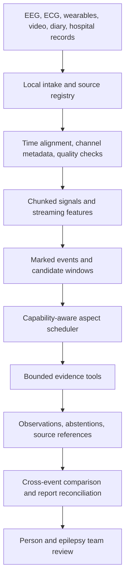

# Roadmap: evidence that helps the next care-team conversation

## Architecture

The diagram includes planned components. Keep large arrays in the signal store and
pass compact, time-bounded evidence to agents. Signal processing computes measurements;
agents propose interpretations and questions; the team reviews clinical meaning.

## What changed in this iteration

- An offline six-event synthetic demo and local HTML/JSON review export.
- Streaming L1 Parquet writes, no duplicated block-boundary windows, and correct handling
  of a recording exactly one feature window long.
- SHA-256 fingerprints of original EDF files in new stores and generated segments.
- Finite, ordered time windows; recording/source checks; explicit missing-montage failures;
  applied notch filtering; and saved scope evidence records.
- Bounded backend retries and scope calls, channel restrictions, and rejection of claims
  with missing or invented scope references. Unsupported input requirements fail explicitly.
- Separate nearby annotation events by default. Overlapping or touching seeds still merge;
  long bridging detections can still combine events and need a better event model.

## Priority 1: a useful personal record

Implement the [patient workflow](helping-your-friend.md): a brief diary, a records checklist,
and a review screen for comparing hospital events with the formal interpretation. Keep
clinician labels separate from patient observations and detector flags. Support corrections
and "not enough information." Export a small packet the person can inspect before sharing.

Done when the person can prepare a follow-up packet without AI, and a reviewer can locate
the original evidence for every observation. No external delivery happens automatically.

## Priority 2: trustworthy multisensor intake

Create a source registry with file hashes, acquisition metadata, channel types, units,
native sampling rates, source clocks, dropout intervals, and consent/access information.
Add CSV/TSV importers for event diaries and medication-administration records. Preserve
unknown timestamps and separate measured offsets from assumed alignment.

Use the [BIDS EEG specification](https://bids-specification.readthedocs.io/en/stable/modality-specific-files/electroencephalography.html)
as the metadata target: EEG recording metadata, channel descriptions, electrode information,
and events belong in explicit companion records. The repo is not currently BIDS-compliant.

Handle clock drift with measured synchronization points and residual error. Align streams
at query time rather than assuming all sensors share one sample rate. In particular,
[MNE's EDF reader](https://mne.tools/stable/generated/mne.io.read_raw_edf.html)
upsamples mixed-rate channels to the highest requested sampling rate; lazy mixed-rate reads
can introduce edge artifacts. The current transcoder uses that reader and does not preserve
each channel's native-rate signal. Address this before interpreting synchronized physiology.

Done when known offsets/drift, missing data, mixed units/rates, and discontinuous recordings
are tested, and uncertainty is visible in every cross-sensor comparison.

## Priority 3: connect a small pool of specialists

| Aspect | Required inputs | Useful output | Abstain when |
| --- | --- | --- | --- |
| Signal quality and artifact | EEG, channel metadata, optional motion/video | Suspicious channels and intervals | Input quality or montage cannot support the assessment |
| EEG event description | Supported EEG montage, bounded traces and features | Observed changes and timing for expert review | Coverage or evidence is insufficient |
| Autonomic context | Validated ECG/HR/HRV and matched baseline | Measured differences with coverage | ECG, a usable baseline, or clock alignment is missing |
| Sleep and medication context | Reviewed sleep labels and timestamped administrations | Context attached to events | Labels or timing are unknown |
| Across-event comparison | Reviewed individual event evidence | Similarities, differences, open questions | Evidence cannot be compared on a common basis |
| Report reconciliation | Formal report and reviewed event/claim table | Agreements, possible discrepancies, questions | Report or event matching is unavailable |

First wire L1 evidence summaries into the runner with stable evidence IDs and provenance.
Then add a capability-aware scheduler that reports `completed`, `skipped_missing_input`,
`abstained`, and `failed` per aspect and event. Recording and claim triggers need their own
execution paths. A local model adapter or explicitly configured remote adapter must deliver
actual images when claiming visual access; a filesystem path is not an image input.

Each run needs model identity, prompt/manifest hashes, extractor version, input fingerprints,
timeouts, error records, cost limits, and a resumable ledger. Persist claims through one writer
or a transactional database before adding worker concurrency. The current JSONL store has
no concurrency guarantees. Add evidence-ID validation for feature and document citations;
the current runner accepts only scope evidence from the same invocation.

## Priority 4: validation before prediction or alerts

Use clinician-reviewed labels and matched non-event windows. Measure event sensitivity,
false positives per recording hour, onset error, data coverage, and abstention rates. For
research across people, separate patients between train/test sets; for personal work,
hold out whole later recordings or days. Overlapping windows from one event must not leak
across evaluation splits. Compare every model with a simple baseline.

Treat the six hospital events as a small retrospective case review, not a sufficient basis
for a personal seizure predictor. The synthetic demo tests wiring only. Prospective alerts,
diagnosis, calibrated risk probabilities, and treatment recommendations remain out of scope
until an appropriate clinical validation and deployment process exists.

## Current technical limits

- Feature power scaling, quality thresholds, filters, and candidate heuristics need validation.
- EEG channel aliases, native references, non-EEG channel handling, and complete montage
  coverage need explicit metadata and tests. The FFT viewer can introduce edge effects.
- Legacy stores have no source fingerprint. Re-transcode originals into a new directory;
  a segment hash alone does not prove the underlying samples are unchanged. Segment hashes
  changed with this schema addition; regenerate derived claims rather than mixing versions.
- New EDF fingerprints identify the archived source, not later manual mutations of a Zarr
  store. Treat canonical stores as immutable; add transform versions and integrity checks.
- Writes preserve existing final destinations but are not a transactional ingestion pipeline;
  interrupted runs may leave partial artifacts. Atomic publication/resume is still needed.
- Local storage is not encrypted by the application. Gitignore does not protect backups,
  cloud-synced folders, logs, or shared machines. Derived evidence remains sensitive.
